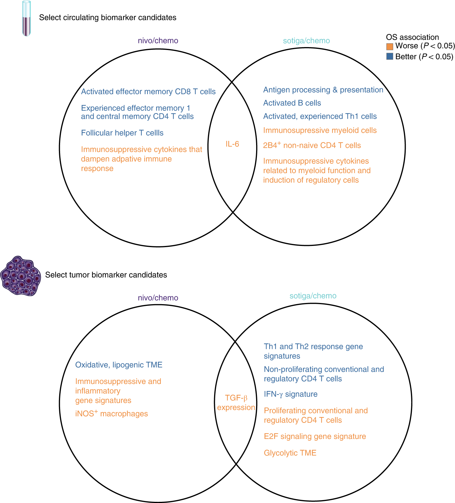

# Four years of<br>Datomic<br>powered ETL in<br>anger with<br>CANDEL

![original] (img/candelmasthead.jpeg)

---
#  Speakers

- Marshall Thompson, PhD
- Benjamin Kamphaus, PhD

---

## The CANDEL Project: History

---

We were both trained as scientists (Ben in Earth Science, Marshall in Genetics and Genomics). We both ended up in the software industry.  PICI & CANDEL were a first return to science for both of us.


CANDEL was an opportunity for us to bring what we learned in software back home.

---

## Several Unique Aspects of The CANDEL Project

---

We both spent time on the Datomic product team at Cognitect prior to the project.


We sat at both sides of the table: starting out as the primary consultants from Cognitect, then as both end users an product owners at PICI.

---
## Parker Institute for Cancer Immunotherapy


- Mission: to accelerate the development of breakthrough immune therapies to turn all cancers into curable diseases.

---

## CANDEL Project Timeline

- Fall 2018: Project starts between PICI & Cognitect
- Jan 2019: First iteration of CANDEL is up and in use
- Spring 2019: First CANDEL integrations with R
- Summer 2019: Mantis 1.0
- Spring 2019: First versions of RawSugar & Enflame

---

## People

Rich, Stu, Ben, Marshall, Federico, Lacey

Mike T, Robin, Rob, George, ...

Informatics Data Scientists: (Chris S, Danny, Nick, Tim, Shannon, Anastasia, Mike S, Kwame, Annie, Jessica, Wesley, Chris L)

---

## CANDEL Project Timeline

- Fall 2020: Ben joins PICI full time
- Summer 2021: Marshall joins PICI full time
- Summer 2022: More than (50?) Datasets in CANDEL
- Spring 2023: CANDEL Open Sourced
  
---
  
## CANDEL Study and Trial Timeline

- some
- bullets
- here

---

# Why CANDEL?

---


## Goal of CANDEL

- increase the pace & quality of research at PICI
- by taking aim at the biggest headaches in biological data:
  - data integration
  - data harmonization

The boring infrastructure problem that bottlenecks biological research

---

## Data Harmonization

- Harmonization is a big problem in biology
- Harmonization is harder than you might expect
- Harmonization is where too much time gets spent instead of science
- Harmonization problems propagate and impact science quality
  
---
## Data harmonization

- Errors creep in
- People spend too much time hunting them down
- People spend too much time hypothesizing about the wrong things and solving the wrong problems
- Not just data sci or dev time lost but “hammock time” also

---

## Eroom's Law


[^1]: https://johnmjennings.com/erooms-law-explaining-the-decline-in-drug-discovery/
[^2]: Diagnosing the decline in pharmaceutical R&D efficiency https://www.nature.com/articles/nrd3681
[^3]: Eroom's law https://www.science.org/content/blog-post/eroom-s-law

---

- 92% of genome sequenced in 2003
- 'complete' in May 2021
- Final gapless assembly in Jan 2022.

---

- The _cost_ of developing a new therapeutic still follows Moore’s law
- cost of sequencing genome has gone from ~$3 billion to $600 in the last twenty years.
- data availability and productions from biological assays have exploded well past exponential growth- greater than Moore’s law

---

## Data's Role

The challenge of handling biological data is not the sole cause of this, but data has either:

- Exacerbated problem
- Had no impact on problem
  
Neither is acceptable

---

## PICI's Unique Data Integration & Harmonization Needs

- Partner sites across academia and industry
- New and experimental assays
- Split across projects, trials, etc

---

## The Shape of Biological Data

- Bulk Molecular Data
- Patient Outcomes
- Clinical Assays
- Imaging
- Single Cell Data
- Features derived from other assays

---

## The Shape of Biological Data

- Deeply relational, deeply nested
- Sparse, lots of holes
- Large and getting larger


^ A patient has tissue has cell populations has cells have molecules
^ We might associate anything below anywhere else in the hierarchy.
^ e.g., proteins or DNA just associated with the patient

---

## There are Two Other Talks on CANDEL

- [Clojure Where it Counts: Tidying Data Science Workflows](https://www.youtube.com/watch?v=ulhr_50bevk)
- [Building a Unified Cancer Immunotherapy Data Library](https://www.youtube.com/watch?v=ulhr_50bevk)

^ These talks give additional context on issues that arise in modeling biological data, as well as the tools Pret and the R libraries that support querying.
^ We're going to focus our discussion of what follows on other parts of the ecosystem, features that changed or were added since the past talks, and the way our use of these tools evolved over time.

---

## The first entry in CANDEL: Pret

[Pret](https://github.com/CANDELbio/pret): automated ETL at the heart of CANDEL
- Turns tables to datoms
- Rules for doing so generated from schema
- data driven generation and inference from schema all the way down
- refer to talk linked in previous slide

---

```clojure
:samples [{:pret/input-file "processed/samples.txt"
           :id              "Originating ID"
           :subject         "Participant ID"
           :timepoint       "VISIT"
           :specimen        "Source Matcode"
           :container       "BioInventory Group Name"}
```

^ Example that would be nested inside of a dataset, defining samples.

---

```clojure
 {:name "CyTOF"
  :technology       :assay.technology/mass-cytometry
  :description      "CyTOF analysis"
  :measurement-sets
  [{:name             "Bendall"
    :cell-populations
    [{:pret/input-file  "processed/cell_populations.txt"
      :pret/na          "NA"
      :name             "name"
      :positive-markers "positive.epitopes"
      :cell-type        "cell.type"}
     ...]
```
^ Example of an analysis type

---


## Early CANDEL Data Model

- INSERT IMAGE of EARLY SCHEMA

---

## Recent CANDEL Data Model


---

## The first tooling for access

- R tools: datalogr, wick, luminance, glow
  - see talk linked on previous slide
- PICI data science used the data in CANDEL primarily from R
- The data model supports query over JSON, so supports:
  - Clojure (both directly from Datomic and as query lib client)
  - Python, or whatever other data science language

---

# Experience Report: Everything is Always Evolving

---

## CANDEL Ecosystem Grew from Here

- RawSugar, upstream
- WorkerBee, upstream
- Mantis, upstream
- Enflame, analysis enablement, dashboard


### [CANDELbio](https://candelbio.github.io/candel-bio-website/)

---

## RawSugar

- Structure handling of raw files
- Relating data as received by vendor with what goes into CANDEL

---

## Mantis

Mantis supports a flow cytometry-like gating workflow for images. (Classifying cell phenotype from scatterplots of marker intensities)

- aggregates features to the level of a cell population or cell
- cell population or cell level features modeled in CANDEL's data model.

---

## Enflame
### Visual Query


^ A tool that uses block "builder" to generate queries, enforcing structure
^ Provides access to multiple DBs, runs query and shows result

---

## Enflame


*All* of these block relationships are dynamically inferred from the DB schema

^ Block layout and query building and how the blocks represent the schema
^ *NONE* of this is hard coded, it all comes from the schema

---

## Example data history: molecular data

- sample manifest and raw assay files
- recorded and stored with RawSugar, pushed into pipelines
- processed data stored with RawSugar
- workerbee used to prepare data for CANDEL and generate config snippet
- prepared data and config committed to azure repo
- then transacted into a CANDEL database

---

## Example data history

- sample manifest and raw image files
- recorded and stored with RawSugar
- image files used in mantis to generate cell population data
- cell population data added to CANDEL config
- then transacted into a CANDEL database

---

## Research Accomplished: Highlights

- Research we accomplished
- Nature papers, etc.
- Morrison 1 
- Amadeus (in preparation) 
- McGraw (in preparation)

---

## PRINCE Study:

- Phase 2 Trial of chemo + nivolumab and/or sotigalimab
- Multi-omic profiling:
  - Immunophenotyping by CyTOF
  - High-parameter flow cytometry of T lymphocytes
  - Serum proteomics profiling
  - Whole-exome and transcriptome sequencing
  - Multiplex imaging

- [Nature Medicine, 2022] (https://www.nature.com/articles/s41591-022-01829-9)

![right fit] (img/princeImage1.jpeg)

---

## PRINCE Study: distill key findings



Multi-dimensional clinical & genomic profiling identifies potential biomarkers that correlate with response to treatment.

This high-dimensional approach will identify new targets for testing and for therapeutic intervention.

^ Pancreatic cancer is notoriously hard to treat and we need new and abnundant markers and targets to improve outcomes. This can only be done with true combinatorial multi-omic approaches

---

# Things that went well and things that didn’t

--- 

## Designing around Schema Evolution was the Biggest Win

If you take nothing else from this talk:

- the schema constantly evolved
- we handled its evolution without code changes by doing things in a data driven fashion
  - pret infers its data compilation logic from schema and metamodel
  - enflame, etc. also generated queries, etc. from inspection of schema
  - only some code changes required R library modifications

---

## Data Harmonization Effort at PICI: Less Work, More Consistent

- Data harmonization effort greatly reduced
- Most common pain point was: “I don’t know what this spec error means
- Good problem to have!
  
These were always real problems with the data! We kept them out of research!

^ We know we could have done more to handle/clean up spec based errors.

---

# Rough Edges

Fault here is ours alone, not Clojure or Datomic's.

---

## Handling datasets built against different schema versions

It took a long time to get acceptable solution for dataset evolution, versioning, etc.

---

## Just use multiple Datomic dbs stupid

- transactional boundaries didn’t really matter (entire dataset split across transactions in alrge batches)
- transactions were never 'live'.
- Multiple versions of db could be stood up
  
---

## Big data and big-ish data

- Big data doesn’t fit well in Datomic, even when it maps to Datoms
- Measurements and creation of measurement matrix/tensor class
- We did this in TSV for R and ease of import, arrow/parquet probably more efficient for tables
- For cloud systems, it probably makes more sense to go into zarr or something similar.
- If you want to do that, it would be a minimal code change.

---

## What we're open sourcing

- This is all open sourced now at CANDELBio
- Data harmonization problems aren’t unique to biology
- We expect data unification/harmonization needs across science could benefit from this toolkit
- We expect other categories of data science can benefit

---

# Where we are now

Getting data at a scale that will support ML, data-driven insights from biology.

- Noetik's mission
- Pattern's mission