theme: Simple, 1
# Four years of<br>Datomic<br>powered ETL in<br>anger with<br>CANDEL
[.header: #FFFFFF, alignment(left)]
![original] (img/candelmasthead.jpeg)

---
#  Speakers

[.column]

![center inline] (img/mtheadshot.png)

[.column]

![center inline] (img/bkheadshot.png)

---
# Speakers

We were both trained as scientists 
  - Ben in Earth Science
  - Marshall in Genetics and Genomics

We both ended up in the software industry.  

PICI & CANDEL were a first return to science for both of us.

CANDEL was an opportunity for us to bring what we learned in software back home.

---


Mission: to accelerate the development of breakthrough immune therapies to turn all cancers into curable diseases.

---

## The CANDEL Project: History

Federico & Lacey Came to Cognitect (through a Datomic evaluation)

 

[.text: #000000, alignment(center)]
**Can**cer **D**ata and **E**vidence **L**ibrary

^ Hundreds of scientific papers are generated each month – all available in the public domain. So, what if there was a way to connect the dots across all the studies? A single system that can not only “see” the emerging and existing data, but perform advanced analysis so that critical scientific questions can be answered with up-to-date, accurate information?

^We couldn’t find a platform like this. So we built one ourselves.

---

## Several Unique Aspects of The CANDEL Project

---

We both spent time on the Datomic product team at Cognitect prior to the project.


We sat at both sides of the table: starting out as the primary consultants from Cognitect, then as both end users and product owners at PICI.

---

## People

[.text: #000000, alignment(center)]

[.column]

 

Project Kick Off

[.column]


Dev Team 

[.column]


Bioinformatics Users

---

## CANDEL Project Timeline
[.autoscale: true]

- Fall 2018: Project starts between PICI & Cognitect
- Jan 2019: First iteration of CANDEL is up and in use
- Spring 2019: First CANDEL integrations with R
- Summer 2019: Mantis 1.0
- Spring 2019: First versions of RawSugar & Enflame
- Fall 2020: Ben joins PICI full time
- Summer 2021: Marshall joins PICI full time
- Summer 2022: More than (50?) Datasets in CANDEL
- Spring 2023: CANDEL Open Sourced
  
---
  
# Why CANDEL?

---


## Goal of CANDEL

- increase the pace & quality of research at PICI
- by taking aim at the biggest headaches in biological data:
  - data integration
  - data harmonization

The boring infrastructure problem that bottlenecks biological research

^ PICI finding itself in a situation lots of data science groups, esp bio ones, do
^ data split across tons of different dbs and storages
^ sometimes that's just excel or google sheet a vendor shares
^ issues with reproducibility, mistakes propagating, etc.

---

## Data Harmonization

- Harmonization is a big problem in biology
- Harmonization is harder than you might expect
- Harmonization is where too much time gets spent instead of science
- Harmonization problems propagate and impact science quality

^To clarify real quick, we're talking MOSTLY about the portion of harmonization that means getting
data into a common representation (not focused on empirical, numerical calibration, correction, etc.)
  
---
## Data harmonization

- Errors creep in
- People spend too much time hunting them down
- People spend too much time hypothesizing about the wrong things and solving the wrong problems
- Not just data sci or dev time lost but “hammock time” also

---

## Eroom's Law

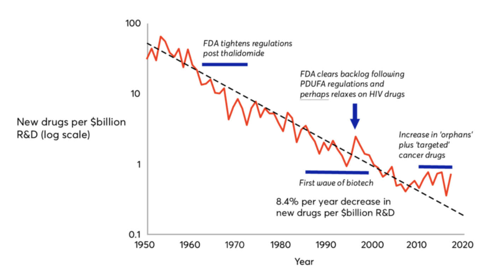

[^1]: https://johnmjennings.com/erooms-law-explaining-the-decline-in-drug-discovery/
[^2]: Diagnosing the decline in pharmaceutical R&D efficiency https://www.nature.com/articles/nrd3681
[^3]: Eroom's law https://www.science.org/content/blog-post/eroom-s-law

^ Now, I'm going to bring this up in the context of pharma/biotech etc. at large.
^ System wide pattern of issues, some regulatory, some with business practices, some with how
^ data is handled, etc., that have resulted in the time+money investment of developing a new drug
^ (or more generally therapeutic) 

---

- 92% of genome sequenced in 2003 ('mission accomplished' point)
- The _cost_ of developing a new therapeutic still follows Moore’s law
- cost of sequencing genome has gone from ~$3 billion to $600 in the last twenty years.
- data availability and productions from biological assays have exploded well past exponential growth- greater than Moore’s law

^ If you look at the reduction in cost and ability to capture data in bio, by comparison, we're
^ looking 

---

## Data's Role

The challenge of handling biological data is not the sole cause of this, but data has either:

- Exacerbated problem
- Had no impact on problem
  
Neither is acceptable

^ if we use a crude analogy and say finding a drug is a needle in a haystack, what this means is
^ with all the data we have, we're mostly just adding more hay to the pile.
^ Can we do better?

---

## The Shape of Biological Data

- Bulk Molecular Data
- Patient Outcomes
- Clinical Assays
- Imaging
- Single Cell Data
- Features derived from other assays

---

## PICI's Unique Data Integration & Harmonization Needs

- Partner sites across academia and industry
- New and experimental assays
- Team effort split across multiple projects, trials, etc
  
^ At PICI, the problem of disorganized data was magnified. We've got partner data from many
^ different sources, some of them academic, or groups piloting a technology with no real
^ informatics support. 

---

## The Shape of Biological Data

- Deeply relational, deeply nested
- Sparse, lots of holes
- Large and getting larger

---


^ Clinical Example - OMOP
^ An effort to produce a unified data model for clinical observations, basically.
^ This is one subset of what we needed to be able to model in CANDEL 
^ 37 tables, 394 fields
^ you have a lot of relation entities

---

## Omics data at PICI

[.column]
- Bulk
- Tissue specific
- Image derived
- Cell populations
- Single Cell

[.column]
- Measured by a particular assay, eg
- RNASeq
- WES
- Metabolic Panel
- Flow

[.column]
- Measurement targets such as
  - Genes
  - Proteins
  - Mutations
  - Non-trivial relations for all the above


^ A patient has tissue has cell populations that have cells have molecules
^ We might physically isolate particular granularities or do it with anayltical techniques, or hybrids (eg. flow gating)
^ We might associate anything below anywhere else in the hierarchy.
^ e.g., proteins or RNA or DNA just associated with the patient
^ All of this, clinical or moleular, is sparse
^ At this point maybe you're thinking through all the linker tables you'd have to build and nullable fields
^ etc. and using something with a triple store heritage like Datomic is starting to make a lot of sense.

---

## There are Two Other Talks on CANDEL

- [Clojure Where it Counts: Tidying Data Science Workflows](https://www.youtube.com/watch?v=ulhr_50bevk)
- [Building a Unified Cancer Immunotherapy Data Library](https://www.youtube.com/watch?v=ulhr_50bevk)

^ These talks give additional context on issues that arise in modeling biological data, as well as the tools Pret and the R libraries that support querying.
^ We're going to focus our discussion of what follows on other parts of the ecosystem, features that changed or were added since the past talks, and the way our use of these tools evolved over time.

---

## The first entry in CANDEL: Pret

[Pret](https://github.com/CANDELbio/pret): automated ETL at the heart of CANDEL
- Turns tables to datoms
- Rules for doing so generated from schema
- data driven generation and inference from schema all the way down
- refer to talk linked in previous slide

---

```clojure
:samples [{:pret/input-file "processed/samples.txt"
           :id              "Originating ID"
           :subject         "Participant ID"
           :timepoint       "VISIT"
           :specimen        "Source Matcode"
           :container       "BioInventory Group Name"}
```

^ Example that would be nested inside of a dataset, defining samples.
^ At the core of Pret are these maps which define a way to turn tables, TSV by
^ our convention, into entity maps (which have a deterministic mapping into datoms)

---

```clojure
:samples [{:pret/input-file "processed/samples.txt"
           :id              "Originating ID"
           :subject         "Participant ID"
           :timepoint       "VISIT"
           :specimen        "Source Matcode"
           :container       "BioInventory Group Name"}
:subjects {:pret/input-file "processed/subjects.txt"
           :id              "USUBJID"
           :race            "RACE"
           :ethnicity       "ETHNIC"
           :therapies       
           {:pret/input-file   "processed/therapies.txt"
            :treatment-regimen "TRTACD"
            :order             "order"
            :pret/reverse      {:pret/rev-variable "USUBJID"
                                :pret/rev-attr     :subject/therapies}}}

```

---

```clojure
 {:name "CyTOF"
  :technology       :assay.technology/mass-cytometry
  :description      "CyTOF analysis"
  :measurement-sets
  [{:name             "Bendall"
    :cell-populations
    [{:pret/input-file  "processed/cell_populations.txt"
      :pret/na          "NA"
      :name             "name"
      :positive-markers "positive.epitopes"
      :cell-type        "cell.type"}
     ...]
```
^ This is an example of an analysis type, here showing cell populations for an assay

---


---


---


---

[.code-highlight: 8, 14, 23, 29]
```clojure
{:name             "CyTOF"
 :technology       :assay.technology/mass-cytometry
 :description      "CyTOF analysis performed at Primity Bio"
 :measurement-sets
 [{:name             "Bendall"
    :cell-populations [{:pret/input-file  "processed/cell_populations_Bendall.txt"
                        :pret/na          "NA"
                        :name             "name"
                        :positive-markers "positive.epitopes"
                        :cell-type        "cell.type"}]
    :measurements     [{:pret/input-file "processed/cytof_measurements_Bendall.txt"
                        :pret/na         "NA"
                        :sample          "sample"
                        :cell-population "uniquePopulationName"
                        :pret/variable   "variable"
                        :pret/value      "value"
                        :pret/variables  {"eventCount"                :measurement/cell-count
                                          "normalization.measurement" :measurement/leukocyte-count
                                          "normalized.measurement"    :measurement/percent-of-leukocytes}}]}
  {:name             "Spitzer"
   :cell-populations [{:pret/input-file  "processed/cell_populations_Spitzer.txt"
                       :pret/na          "NA"
                       :name             "name"
                       :positive-markers "positive.epitopes"
                       :cell-type        "cell.type"}]
   :measurements     [{:pret/input-file "processed/cytof_measurements_Spitzer.txt"
                       :pret/na         "NA"
                       :sample          "sample"
                       :cell-population "uniquePopulationName"
                       :pret/variable   "variable"
                       :pret/value      "value"
                       :pret/variables  {"eventCount"                :measurement/cell-count
                                         "normalization.measurement" :measurement/leukocyte-count
                                         "normalized.measurement"    :measurement/percent-of-leukocytes}}]}]}]
```
---

```clojure
{:kind/name        :assay
 :kind/attr        :assay/name
 :kind/context-id  :assay/name
 :kind/need-uid    :assay/uid
 :kind/parent      :dataset}
{:kind/name        :measurement-set
 :kind/attr        :measurement-set/name
 :kind/context-id  :measurement-set/name
 :kind/parent      :assay
 :kind/need-uid    :measurement-set/uid}
{:kind/name        :cell-population
 :kind/attr        :cell-population/name
 :kind/context-id  :cell-population/name
 :kind/parent      :measurement-set
 :kind/need-uid    :cell-population/uid}
```

^ And we did all of this with the metamodel. Which was explicitly modeled in Datomic. Pret uses the information
^ -- unique ID and context components, parent/child relations, etc. -- to drive the ID resolution.

---


## Recent CANDEL Data Model

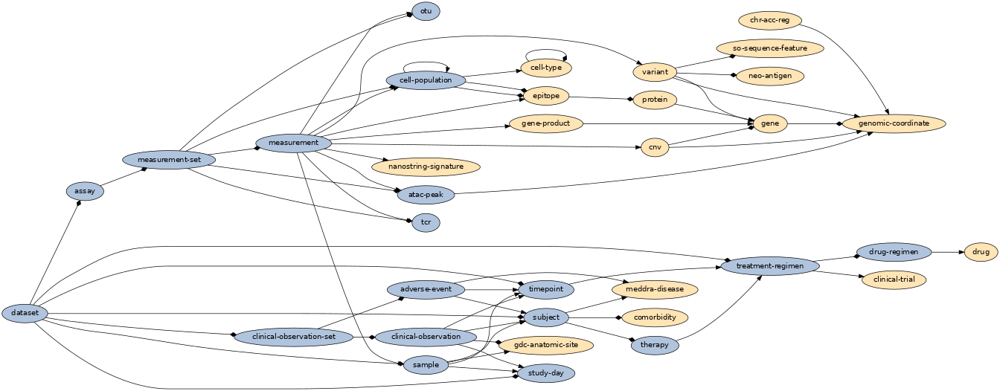

---

## The first tooling for access

- R tools: datalogr, wick, luminance, glow
  - see talk linked on previous slide
- PICI data science used the data in CANDEL primarily from R
- The data model supports query over JSON, so supports:
  - Clojure (both directly from Datomic and as query lib client)
  - Python, or whatever other data science language

---

# Experience Report: Everything is Always Evolving

---

## [CANDEL](https://candelbio.github.io/candel-bio-website/) Ecosystem Grew from Here

[.column]

- RawSugar, upstream
- WorkerBee, upstream
- Mantis, upstream
- Enflame, analysis enablement, dashboard

[.column]

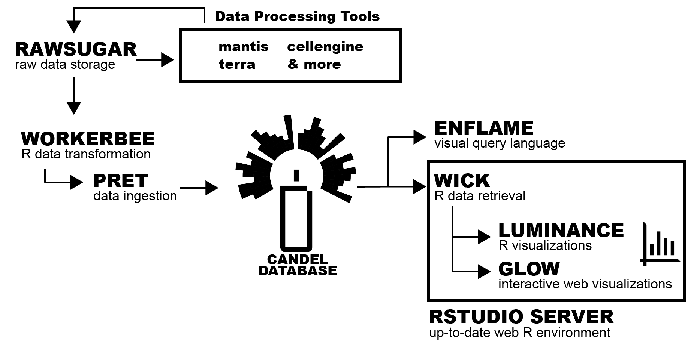

---

## RawSugar

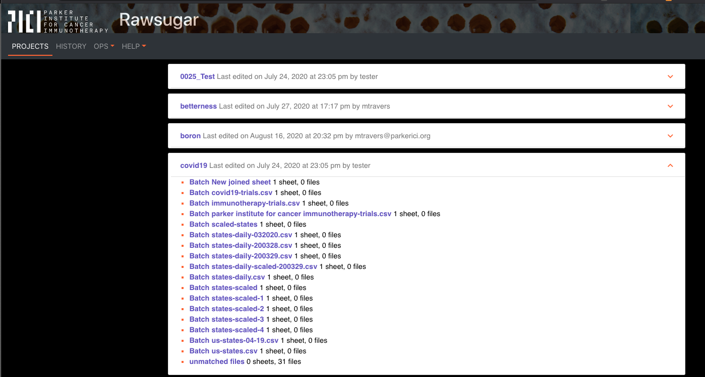

- Structured handling of raw files
- Built on Datomic, includes an immutable history of all file updates and changes

---

## RawSugar

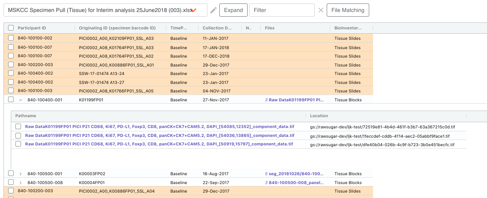 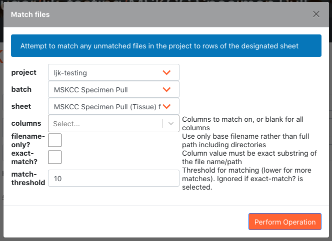

- Relating data as received by vendor with what goes into CANDEL
- Fuzzy file matching & metadata management

---

## RawSugar

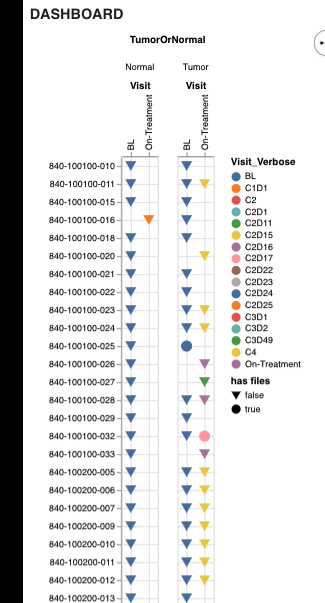

- Organization and management of data to ensure completeness

---

## Mantis

Mantis is a viewing and analysis tool for multi-channel microscopy imaging

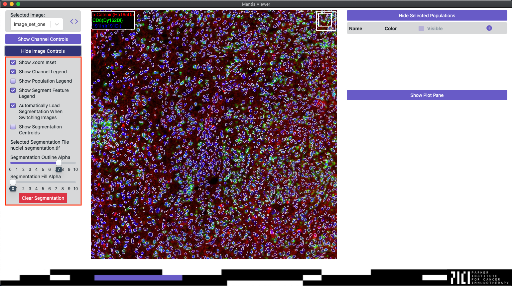

---

## Mantis


- Scatterplot of marker intensities
- Region and cell population selection and filtering

---

## Mantis

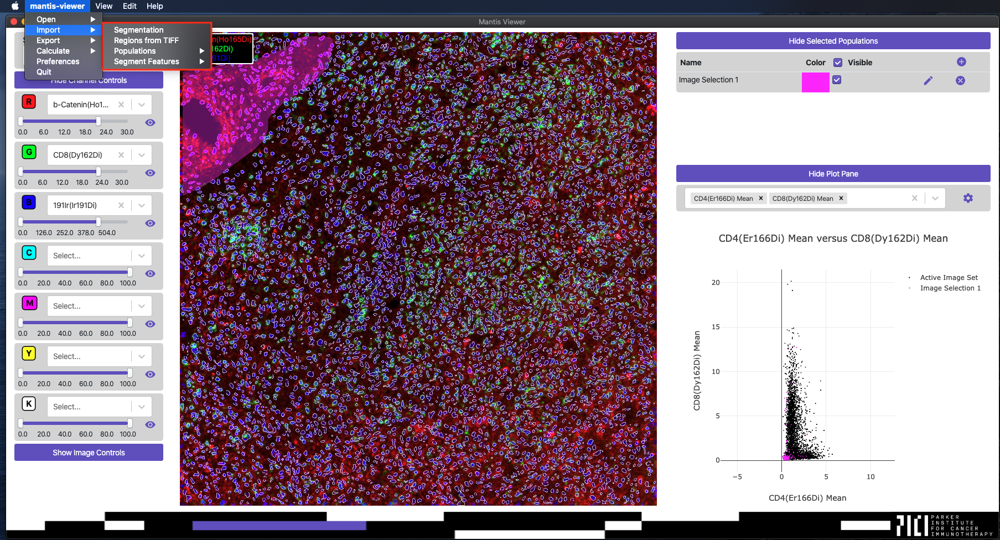

- Aggregates features to the level of a cell population or cell
- Cell population or cell level features modeled in CANDEL's data model

---

## Enflame
### Visual Query


^ A tool that uses block "builder" to generate queries, enforcing structure
^ Provides access to multiple DBs, runs query and shows result

---

## Enflame

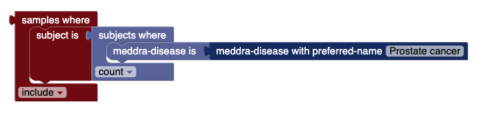

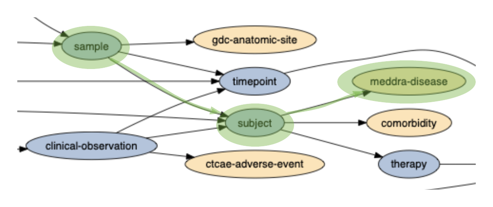

*All* of these block relationships are dynamically inferred from the DB schema

^ Block layout and query building and how the blocks represent the schema
^ *NONE* of this is hard coded, it all comes from the schema

---

## Using the CANDEL System

---

## Example data history - before CANDEL

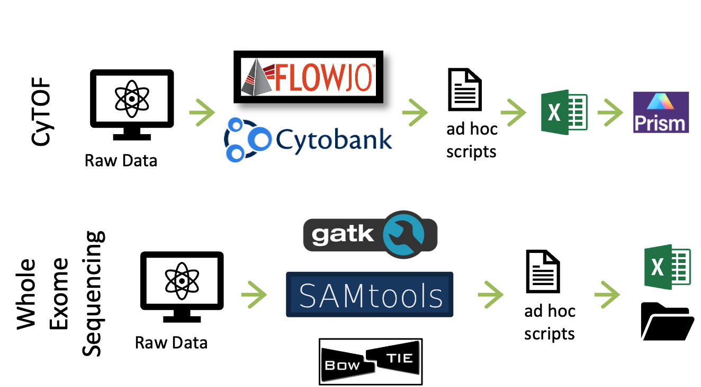

---

## Example data history - with CANDEL


CANDEL provides a unified set of processes, workflows, and validations from data ingestion to analysis

---

## The CANDEL Ecosystem

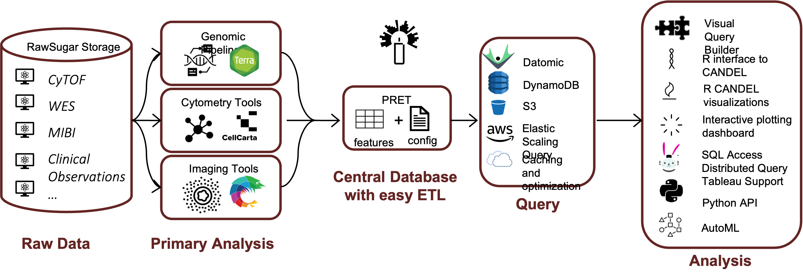

This unified set of processes supports a growing set of assay types and downstream analysis consumers

---

## CANDEL-powered Research: Highlights
[.autoscale: true]

- [Prince - Phase 2 combination trial in pancreatic cancer](https://www.nature.com/articles/s41591-022-01829-9)
- [Morrison 1 - Effect of prior treatment(s) on IO therapy](https://doi.org/10.1016/j.ccell.2023.03.010)
- [Radiohead - Relationship between adverse events and IO therapy](https://jitc.bmj.com/content/10/Suppl_2/A1304)
- [Revolution - Novel IO combination trial for pancreatic cancer](https://jitc.bmj.com/content/10/Suppl_2/A687)
- [Morisson 2 - Multiplex imaging to uncover features of the TME] (https://jitc.bmj.com/content/10/Suppl_2/A1342)
- [Porter - Biomarkers of response in prostate cancer](https://jitc.bmj.com/content/10/Suppl_2/A585)
- Amadeus - Can gut bacteria help destroy tumors? (in preparation) 
- McGraw - Biomarkers for checkpoint response in hot vs. cold tumors (in preparation)

---

## PRINCE Study:

- Phase 2 Trial of chemo + nivolumab and/or sotigalimab
- Multi-omic profiling:
  - Immunophenotyping by CyTOF
  - High-parameter flow cytometry of T lymphocytes
  - Serum proteomics profiling
  - Whole-exome and transcriptome sequencing
  - Multiplex imaging

- [Nature Medicine, 2022] (https://www.nature.com/articles/s41591-022-01829-9)

![right fit] (img/princeImage1.jpeg)

---

## PRINCE Study: Key Findings

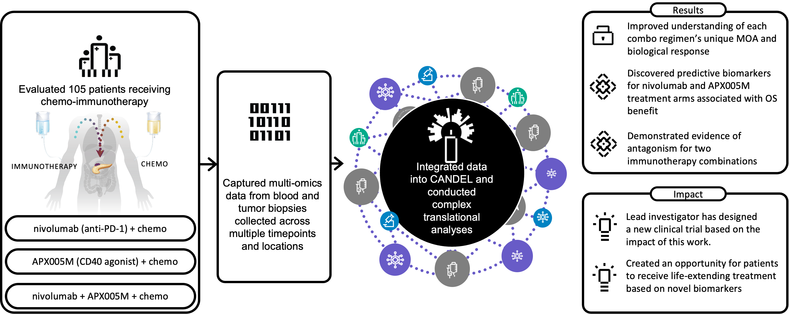

^ Multi-dimensional clinical & genomic profiling identifies potential biomarkers that correlate with response to treatment.

^ This high-dimensional approach will identify new targets for testing and for therapeutic intervention.

^ Pancreatic cancer is notoriously hard to treat and we need new and abnundant markers and targets to improve outcomes. This can only be done with true combinatorial multi-omic approaches

---

## Data in CANDEL

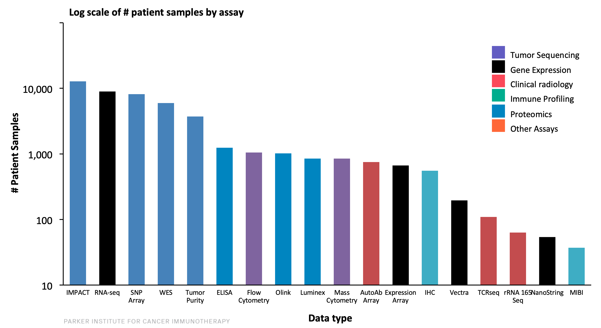

---

# Things that went well and things that didn’t

--- 

## Biggest Win: Designing Around Schema Evolution

If you take nothing else from this talk:

- The schema constantly evolved
- We handled its evolution without code changes by doing things in a data driven fashion
  - Pret infers its data compilation logic from schema and metamodel
  - Enflame, etc. also generates queries, etc. from inspection of schema
  - Only some schema changes required R library code modifications

^ we changed names of entities
^ we added new reified edges -- indirection in linker entities
^ we changed ontologies/controlled vocabularies
^ we changed entity to entity relations:
^ example of protein that had a cardinality reference one relationship to gene
^ but some proteins are produced by multiple homologous genes and it's not possible
^ to tell from the structure or assay which gene was translated to produce it.

---

## Data Harmonization Effort at PICI: Less Work, More Consistent

- Data harmonization effort greatly reduced
- Most common pain point was: “I don’t know what this spec error means
- Good problem to have!
  
These were always real problems with the data! We kept them out of research!

^ We know we could have done more to handle/clean up spec based errors.
^ But also, we often needed to have conversations around some of these, because the cleaning steps
^ or steps necessary eg to find where IDs got mangled, etc. are non-trivial and might require
^ other team members.

---

# Rough Edges

Fault here is ours alone, not Clojure or Datomic's.

---

## Handling datasets built against different schema versions

It took a long time to get acceptable solution for dataset evolution, versioning, etc.

---

## Just use multiple Datomic dbs stupid

- transactional boundaries didn’t really matter (entire dataset split across transactions in alrge batches)
- transactions were never 'live'.
- Multiple versions of db could be stood up
  
---

## Big data and big-ish data

- Big data doesn’t fit well in Datomic, even when it maps to Datoms
- Single cell and image derived features forced data out of Datomic.
  - Solution solved some pain we'd been experiencing with larger measurement sets.

---

## Measurement Matrix

```clojure
:measurement-matrices
[{:name "screening-rna-seq"
  :measurement-type :measurement/read-count
  :pret.matrix/input-file "dense-rnaseq.tsv"
  :pret.matrix/format :pret.matrix.format/dense
  :pret.matrix/column-attribute :measurement-matrix/gene-products
  :pret.matrix/indexed-by {"sample.id" :measurement-matrix/samples}}
 {:name "single cell counts"
  :measurement-type :measurement/read-count
  :pret.matrix/constants {:measurement-matrix/samples "SYNTH-SC-DATA-01"}
  :pret.matrix/input-file "short-processed-counts.tsv"
  :pret.matrix/format :pret.matrix.format/sparse
  :pret.matrix/indexed-by {"barcode" :measurement-matrix/single-cells
                           "hugo" :measurement-matrix/gene-products}}]}]}]

```

---

References to entities in Datomics (as unordered set), numeric values not.


^ So for these cases you would need to go out of Datomic to get the file from S3, but in R or Python, etc.
^ you can join on these entities. Pret processes them to ensure the IDs match and to run all entries against the
^ spec (so subject to same quality checks as individual measurements.)
^ there are schemas that probably make sense that only ever use measurement matrices for data consisting primarily of numeric values.

---

## Measurement Matrix

- We did this in TSV for R and ease of import, arrow/parquet probably more efficient for tables
- For cloud systems, it probably makes more sense to go into zarr or something similar.
- If you want to do that, it would be a minimal code change.

---

[.column]

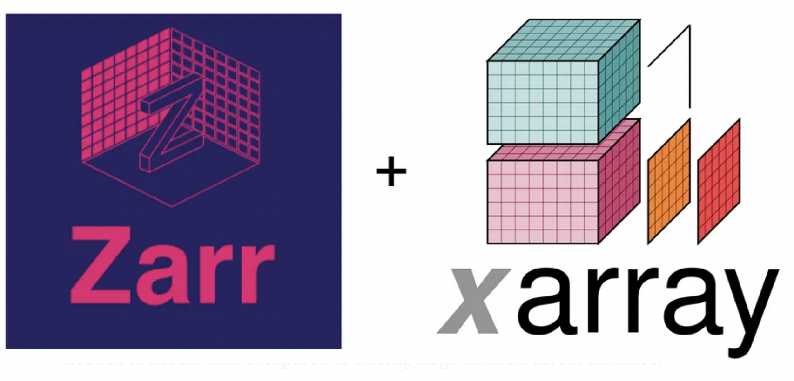

- Other formats could be built in for matrix types, eg. Parquet or Zarr ecosystems.

[.column]


---

## What we're open sourcing

- This is all open sourced now at CANDELBio
- Data harmonization problems aren’t unique to biology
- We expect data unification/harmonization needs across science could benefit from this toolkit
- We expect data science in general or even other ETL workflows can benefit

---

# Where we are now

Getting data at a scale that will support ML, data-driven insights from biology.

- Noetik's mission
- RCRF's mission

---

## Thanks

